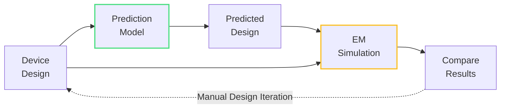
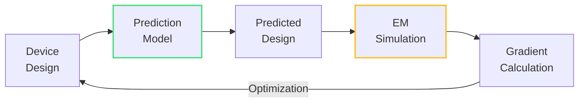

The gap between designed and fabricated photonic circuits is well-known: corners round, features erode, and structures deviate from their ideal geometries. Traditional approaches handle this with conservative design margins, effectively trading performance headroom for fabrication tolerance.

Fabrication-aware design offers a different approach. By predicting how designs will actually fabricate, you can verify performance before manufacturing, correct designs to compensate for known effects, or optimize directly for fabricated structures rather than idealized ones.

!!! note "Note"

    While our general documentation focuses on planar geometric variations, the same principles extend to other critical fabrication effects. PreFab supports or is developing support for other effects such as sidewall angle, material thickness variations, and surface roughness - all of which significantly impact photonic device performance.

## How it works

PreFab provides trained prediction and correction models for various fabrication processes. These models have learned the relationship between designs and fabricated outcomes, enabling accurate predictions of how specific layouts will transform during manufacturing.

The models work in two directions:

**Prediction**: Design → Fabricated structure
**Correction**: Desired structure → Design that fabricates correctly

[Reach out to us](mailto:hi@prefabphotonics.com) if you'd like support for your fabrication process.

These models enable three complementary workflows:

1. [Design verification](#design-verification) — Predict and validate before fabrication
2. [Design correction](#design-correction) — Compensate for fabrication effects
3. [Fabrication-aware inverse design](#fabrication-aware-inverse-design) — Optimize for fabricated performance

## Design verification

Design verification uses prediction models to assess how fabrication will affect device performance before committing to manufacturing.

> For a simplified example, see our [prediction notebook](examples/1_prediction.ipynb).

The workflow is straightforward: run your design through the prediction model to generate the expected fabricated structure, then simulate both the ideal and predicted geometries. Comparing the results reveals whether fabrication effects will significantly impact your performance targets.

This is particularly valuable for complex devices or those pushing fabrication limits. Rather than relying on intuition or design rules alone, you can make data-driven decisions about whether to proceed with fabrication, iterate the design, or apply corrections.

### Stochastic effects and yield analysis

Because our models are trained on real fabrication data with natural process variations, they capture stochastic effects inherent to manufacturing. This enables a more sophisticated form of verification: running multiple predictions on the same design to simulate different fabrication outcomes.

By generating and simulating many possible fabricated versions of a single design, you can assess performance variability and estimate yield. This is especially valuable for understanding how sensitive a design is to process variations—a critical consideration for production-scale deployment where manufacturing tolerances directly impact device yield and cost.

## Design correction

Design correction automatically compensates for fabrication effects by pre-distorting layouts to account for known manufacturing variations.

> For a simplified example, see our [correction notebook](examples/2_correction.ipynb).

The correction model works in reverse from prediction. Instead of predicting what a design will fabricate into, it generates a design that will fabricate into your target structure. The model adjusts geometries by adding material where erosion is expected and removing it where dilation occurs.

The corrected design can go directly to fabrication or through verification first for additional confidence. While correction cannot achieve perfect results—some features like sharp 90° corners remain physically constrained—it consistently produces significant improvements, often recovering much of the performance loss from fabrication effects.

A key advantage: correction can improve existing designs without requiring a complete redesign. For circuits that are functionally working but underperforming due to fabrication variations, correction offers a practical path to better performance.

## Fabrication-aware inverse design

Fabrication-aware inverse design (FAID) integrates fabrication effects directly into the optimization process rather than treating them as a post-processing step.

In this approach, the prediction model operates within the optimization loop itself. Each design iteration is predicted, simulated, and evaluated based on its expected fabricated form rather than its idealized geometry. The optimizer receives gradients based on fabricated performance, naturally guiding the design toward structures that work well after manufacturing.

This is particularly valuable for fabrication effects that cannot be easily corrected through geometric pre-distortion, such as stochastic roughness or certain etching behaviors. By optimizing with these effects in the loop, the design process can work around fundamental constraints rather than fighting them.

The tradeoff: FAID requires more computational resources and setup compared to verification or correction workflows. However, for high-performance devices where marginal gains matter, it offers a path to extracting maximum performance from a given fabrication process.

> For a detailed example, see this [fabrication-aware inverse design tutorial](https://www.flexcompute.com/tidy3d/examples/notebooks/Autograd23FabricationAwareInvdes/).

## Choosing an approach

These three workflows are complementary rather than mutually exclusive. Many design processes benefit from combining them:

- **Start with verification** to understand how fabrication will affect your existing designs and identify which devices need attention.
- **Use correction** to improve existing designs or as a fast path to better performance without full redesign.
- **Deploy FAID** for new designs where maximum performance is critical and computational resources permit.

The common thread: all three approaches use the same underlying prediction and correction models, making it straightforward to move between workflows as your needs evolve.

Interested in applying fabrication-aware design to your process? [Reach out to us](mailto:hi@prefabphotonics.com) to discuss how these approaches can work for your specific devices and fabrication requirements.
