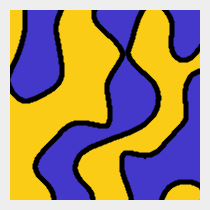
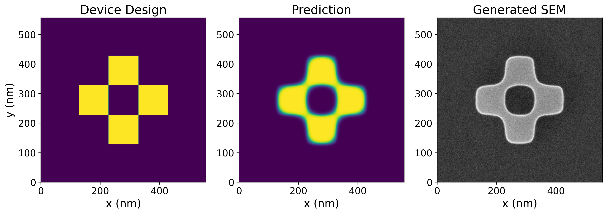
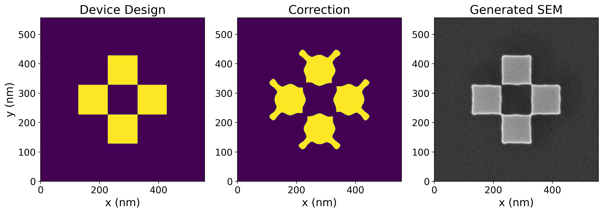

PreFab is a virtual nanofabrication environment that leverages deep learning to model fabrication-induced structural variations in integrated photonic devices. Our mission is to bridge the gap between design and fabrication in photonic integrated circuits.

## What PreFab does

### Prediction of fabrication

Anticipate how your designs will be affected by real fabrication processes. PreFab predicts process-induced structural variations: corner rounding, loss of small features, filling of narrow gaps, sidewall angle variations, and stochastic effects.

### Correction of fabrication

Automatically optimize your designs to ensure fabricated results match your specifications. Our correction algorithms help minimize structural variations and reduce performance discrepancies between simulations and fabricated devices.

## Getting started

!!! tip "Quick links"
    1. [Setup guide](setup.md)
    2. [Learn about fabrication-aware design](fab_aware_design.md)
    3. [Explore example notebooks](examples/1_prediction.ipynb)

!!! info "Try Rosette (beta)"
    Want a more visual experience? Try the [Rosette beta](https://rosette.dev) - our new layout tool with PreFab models built in, designed for rapid chip design.

## Get in touch

PreFab is continuously evolving to serve the photonics community better. We welcome your feedback and contributions. Share your thoughts via [email](mailto:hi@prefabphotonics.com), report issues on [GitHub](https://github.com/PreFab-Photonics/PreFab/issues), or follow our updates on [LinkedIn](https://www.linkedin.com/company/prefab-photonics).
